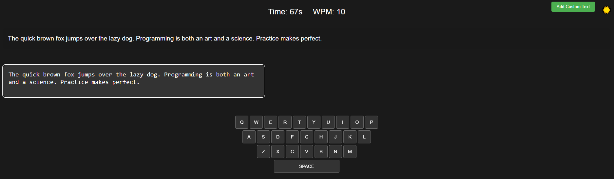
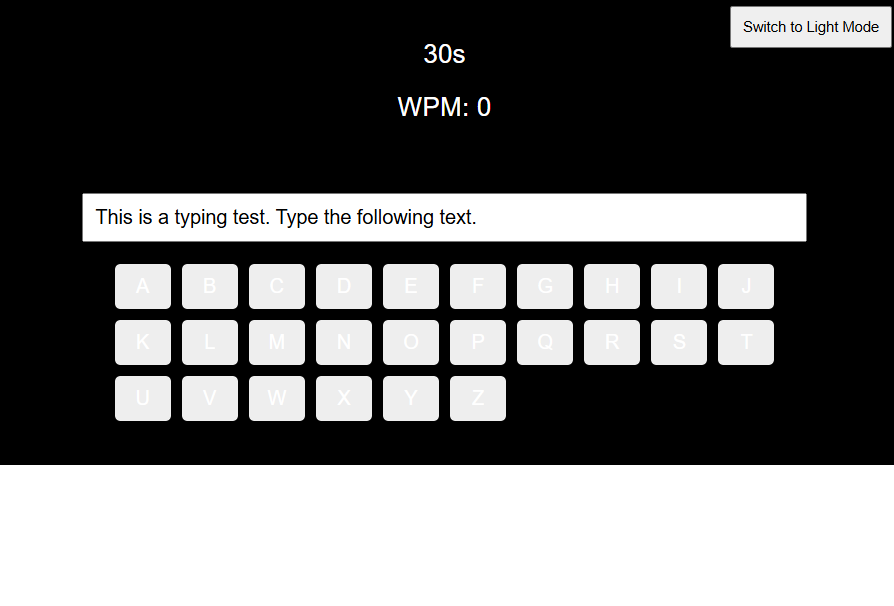

## Prompt1

`template` 內嵌 `test_prompts`

## dependency graph

## Result

有好幾個錯誤
1. 開始打字時沒有開始倒數計時，要等到按下Enter鍵才會開始倒數計時
2. 按下鍵盤按鍵時，畫面顯示對應的鍵盤字母沒有改變顏色
3. 切換成暗色模式時，不會整個頁面都變暗，只有hompage的背景會變暗
4. 切換成暗色模式時，要打的文字內容的文字顏色不會變換顏色，導致維持黑色會看不清楚
5. 切換成暗色模式時，鍵盤的樣式會讓字母看起來不清楚
6. 把內容打完後，應該要跳出一個結算畫面顯示WPM，且會有重新開始的選項，但是沒有
7. 沒有一個可以自己上傳自訂的打字文本的功能

