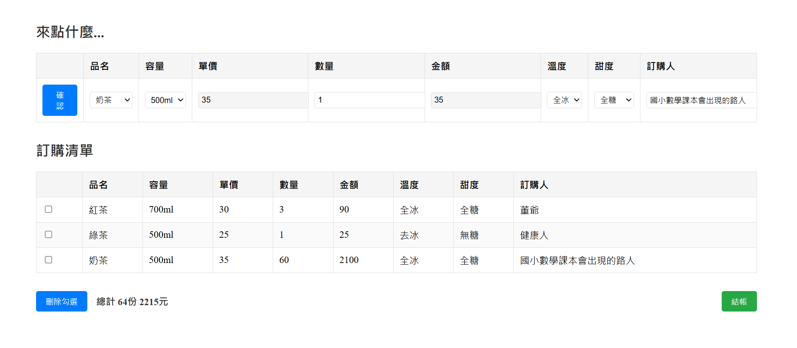
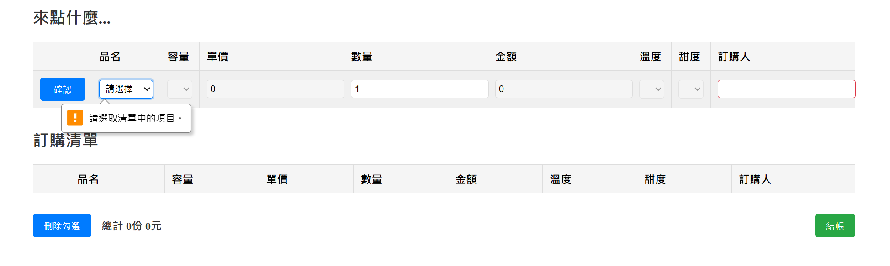
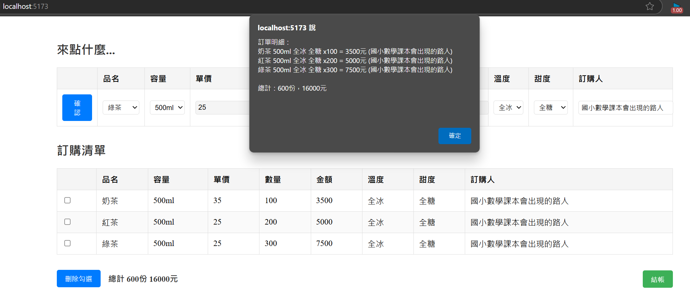

## Prompt 1:
我事先在本地端把react和vite框架弄好了，請根據以下檔案架構分層，給我分層中的所需檔案，並根據以下prompt.md生出網頁，給我react框架的所有程式碼
```txt
./src/App.jsx
./src/index.jsx
./src/styles/App.css
./src/components/OrderForm.jsx
./src/components/OrderTable.jsx
./src/store/utils.js
./index.html
```
(prompt.md)

## Conclusion

第一次提問的結果已符合全部的條件
且所有檔案的位置皆正確
並完成了所有的進階功能要求

#### 外觀


#### 進階功能要求


