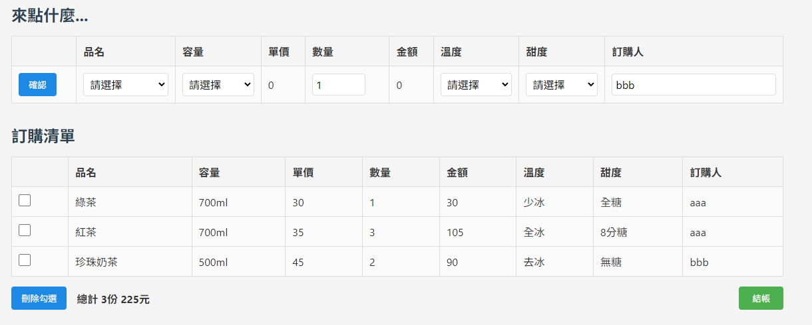

<事先有把react和vite弄好，只讓LLM生出>
## Prompt 1:

我事先在本地端把react和vite框架弄好了，請根據以下檔案架構分層，給我分層中的所需檔案，並根據以下prompt生出網頁，給我react框架的所有程式碼

```txt
./src/App.jsx
./src/index.jsx
./src/styles/App.css
./src/components/OrderForm.jsx
./src/components/OrderTable.jsx
./src/store/utils.js
./index.html
```

## Prompt 2:

index.html中import utils.js的路徑錯了，請重新給我完整程式碼



## Prompt 3:

請根據以下錯誤修改對應程式碼：

1. utils.js中的資料過少，像是紅茶只有對應到700ml，但是每個飲料都可以對應到不同的容量，因此請生出更多的虛擬資料，請重新給我utlis.js檔案
2. 在Ordertable.jsx中的最前方勾選的部分沒有辦法勾選，請修改對應程式碼
3. 按下結帳按鈕之後，訂單明細中的'-'請改成'='

## Prompt 4:

請根據以下錯誤修改對應程式碼：

1. 在品名清單中，有很多個相同的綠茶、紅茶，很多名字相同的品項出現很多次，請修改相關程式碼


## Prompt 5:

請根據以下錯誤修改對應程式碼：

1. 在選取容量清單時，點擊裡面的選項之後會沒有回應。

## Prompt 6:

請根據以下錯誤修改對應程式碼：

1. 在訂購清單中，勾選部分無法選取
2. 在訂購清單中，沒有顯示出訂購人

## Prompt 7:

請根據以下錯誤修改對應程式碼：

1. OrderSelect的部分我希望用useState來切換狀態
2. 點擊刪除勾選時，被勾選的訂單要被刪除

## Done
